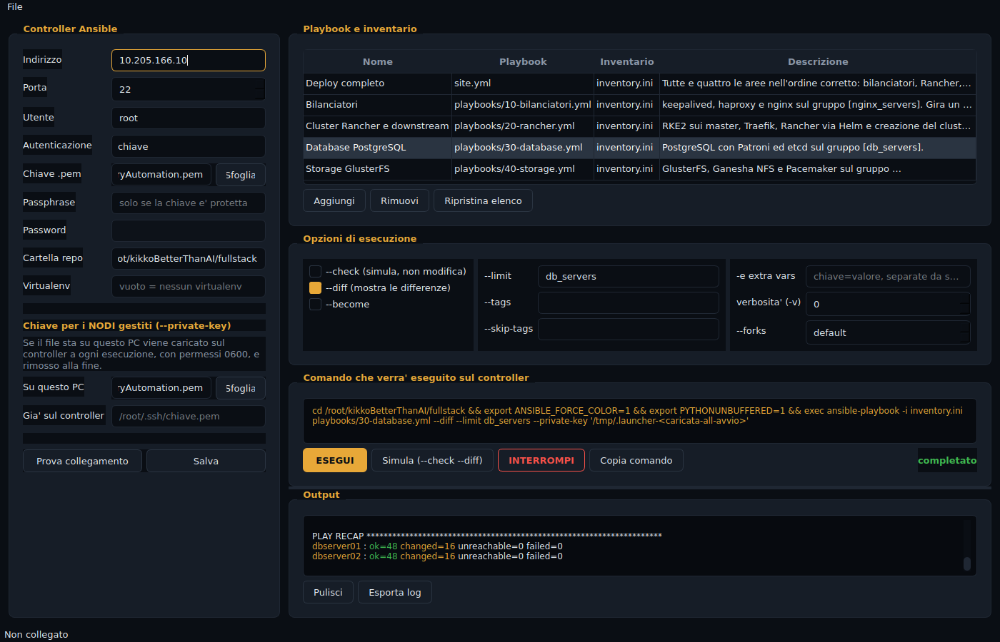

# Ansible Launcher

Applicazione desktop per Windows che esegue i playbook di questo repository,
nello stile di Semaphore. Non e' una pagina web: e' una finestra nativa, con la
console dell'output integrata.



## Come funziona, e perche' cosi'

**Ansible non gira su Windows.** Non e' una scelta: il controller deve essere
Linux. Il software quindi si collega in SSH al controller Ansible, esegue li'
`ansible-playbook` e riporta l'output riga per riga mentre esce.

```
   Windows                          Controller Ansible                Nodi
┌──────────────┐   SSH (paramiko)  ┌───────────────────┐   SSH    ┌──────────┐
│   Launcher   │ ────────────────► │  ansible-playbook │ ───────► │ rancher  │
│              │ ◄──────────────── │  (repository)     │          │ db       │
└──────────────┘   output live     └───────────────────┘          │ gluster  │
      ▲                                                            └──────────┘
      │ chiave .pem del controller          chiave .pem dei nodi (--private-key)
```

Ci sono **due chiavi distinte**, ed e' importante non confonderle:

| Chiave | A cosa serve | Dove sta |
|---|---|---|
| Controller | far entrare il Launcher nel controller | su questo PC |
| Nodi gestiti | far entrare Ansible nelle macchine | sul controller, oppure caricata da qui |

Se la chiave dei nodi sta sul tuo PC (per esempio
`C:\Users\D.Pascolini\Desktop\IAC-pem\DeliveryAutomation.pem`), il software la
carica sul controller a ogni esecuzione con permessi `0600`, la passa ad Ansible
con `--private-key`, e la **rimuove alla fine**. Se invece e' gia' sul
controller, basta indicarne il percorso nel campo apposito e non viene caricato
niente.

Nessuna password e nessuna passphrase viene mai scritta su disco.

## Installazione su Windows

### 1. Python

Scarica Python 3.10 o piu' recente da
[python.org/downloads](https://www.python.org/downloads/) e durante
l'installazione **spunta "Add Python to PATH"** nella prima schermata. E' la
casella che quasi tutti saltano ed e' quella che serve.

Verifica aprendo il Prompt dei comandi:

```
py --version
```

### 2. Portare il codice sul PC

Se hai Git per Windows:

```
cd %USERPROFILE%\Desktop
git clone https://github.com/daniele9233/fullstack.git
cd fullstack\windows-launcher
```

Altrimenti scarica lo zip del repository da
`https://github.com/daniele9233/fullstack/archive/refs/heads/main.zip`,
estrailo, e apri la cartella `windows-launcher`.

### 3. Avvio

Doppio clic su **`run.bat`**.

Al primo avvio crea l'ambiente Python e installa le dipendenze da solo: ci
mette un minuto e lo dice. Dalle volte successive parte subito.

### 4. Eseguibile singolo (facoltativo)

Per avere un `.exe` da copiare dove serve, che non richiede Python sulla
macchina di destinazione:

```
build.bat
```

Produce `dist\AnsibleLauncher.exe`. Da li' in poi si lancia quello, anche senza
la cartella del progetto.

## Uso

### 1. Collegamento al controller

Nel pannello di sinistra:

| Campo | Esempio |
|---|---|
| Indirizzo | `10.205.166.10` |
| Utente | `root` |
| Autenticazione | `chiave` |
| Chiave .pem | `C:\Users\D.Pascolini\Desktop\IAC-pem\DeliveryAutomation.pem` |
| Cartella repo | `/root/kikkoBetterThanAI/fullstack` |
| Virtualenv | vuoto, oppure `~/ansible-env` |

**Prova collegamento** verifica tutto prima di lanciare qualcosa: dice quale
utente sei sul controller, che sistema c'e', quale versione di Ansible risponde
e se la cartella del repository esiste davvero.

**Salva** memorizza le impostazioni in
`%APPDATA%\AnsibleLauncher\config.json`.

### 2. Playbook e inventario

L'elenco arriva gia' compilato con i playbook del repository, **ognuno con il
proprio inventario**:

| Nome | Playbook | Inventario |
|---|---|---|
| Verifica pre-installazione | `playbooks/00-verifica.yml` | `inventory.ini` |
| Deploy completo | `site.yml` | `inventory.ini` |
| Bilanciatori | `playbooks/10-bilanciatori.yml` | `inventory.ini` |
| Cluster Rancher e downstream | `playbooks/20-rancher.yml` | `inventory.ini` |
| Database PostgreSQL | `playbooks/30-database.yml` | `inventory.ini` |
| Storage GlusterFS | `playbooks/40-storage.yml` | `inventory.ini` |

La **verifica** apre l'elenco perche' va lanciata per prima: guarda le macchine
e non tocca niente (porte gia' occupate, firewall, dischi, VIP, nodi che si
parlano), e stampa una scheda per nodo piu' un riepilogo finale. E' anche il
playbook giusto per provare il collegamento la prima volta, visto che non puo'
cambiare niente su nessuna macchina.

Le celle sono modificabili: per dare a un playbook un inventario diverso basta
scriverlo nella sua riga. **Aggiungi** crea una voce nuova, **Ripristina
elenco** torna a quella predefinita.

### 3. Opzioni

Corrispondono una a una ai parametri di `ansible-playbook`:

| Opzione | Comando |
|---|---|
| `--check` | simula, non modifica niente |
| `--diff` | mostra cosa cambierebbe |
| `--become` | esegue con privilegi elevati |
| `--limit` | restringe agli host indicati, es. `db_servers` |
| `--tags` / `--skip-tags` | filtra i task |
| `-e extra vars` | `postgres_force_reinit=true etcd_client_port=2479` |
| verbosita' | da `-v` a `-vvvv` |
| `--forks` | host in parallelo |

### 4. Esecuzione

Il riquadro **Comando che verra' eseguito sul controller** mostra la riga esatta
prima di lanciarla, e si aggiorna a ogni modifica. **Copia comando** la mette
negli appunti, se preferisci eseguirla a mano.

- **ESEGUI** lancia il playbook
- **Simula** forza `--check --diff` senza toccare le caselle
- **INTERROMPI** manda Ctrl-C al playbook in corso, come faresti da terminale

L'output arriva in tempo reale, con i colori di Ansible: verde `ok`, giallo
`changed`, rosso `failed`. **Esporta log** lo salva su file senza i codici
colore.

## Comandi generati

Con questi campi:

- cartella repo `/root/kikkoBetterThanAI/fullstack`
- playbook `playbooks/30-database.yml`, inventario `inventory.ini`
- `--limit db_servers`, `-e postgres_force_reinit=true`

il software esegue sul controller:

```bash
cd /root/kikkoBetterThanAI/fullstack \
  && export ANSIBLE_FORCE_COLOR=1 \
  && export PYTHONUNBUFFERED=1 \
  && exec ansible-playbook -i inventory.ini playbooks/30-database.yml \
       --limit db_servers -e postgres_force_reinit=true
```

`ANSIBLE_FORCE_COLOR` tiene i colori anche quando l'output non va su un
terminale; `PYTHONUNBUFFERED` evita che arrivi a blocchi invece che riga per
riga.

Con il virtualenv indicato si aggiunge l'attivazione:

```bash
cd /root/kikkoBetterThanAI/fullstack \
  && export ANSIBLE_FORCE_COLOR=1 \
  && export PYTHONUNBUFFERED=1 \
  && source "$HOME"/ansible-env/bin/activate \
  && exec ansible-playbook -i inventory.ini site.yml
```

## Struttura

```
windows-launcher/
  main.py                  avvio
  launcher/
    commands.py            composizione delle righe di comando
    config.py              impostazioni, salvate in %APPDATA%
    runner.py              SSH e lettura dell'output (paramiko)
    ansi.py                colori ANSI di Ansible in HTML
    theme.py               palette e foglio di stile
    ui.py                  finestra principale
  tests/test_commands.py   verifiche della composizione dei comandi
  run.bat                  avvio senza compilare
  build.bat                genera AnsibleLauncher.exe
```

`commands.py` non sa niente di SSH ne' di interfaccia: e' logica pura, e per
questo e' l'unico pezzo con dei test automatici. Si eseguono con:

```
python tests\test_commands.py
```

## Note

**Ogni campo di testo viene quotato** prima di finire nel comando. Senza,
un `--limit` scritto come `db; rm -rf /` diventerebbe un secondo comando
eseguito sul controller: c'e' una verifica automatica apposta.

**La chiave host del controller viene accettata al primo collegamento**
(`AutoAddPolicy`). Va bene per una macchina nota dell'infrastruttura; su una
rete non fidata andrebbe sostituita con un `known_hosts` popolato.

**Un playbook alla volta.** Finche' ce n'e' uno in corso, ESEGUI resta
disabilitato: due `ansible-playbook` sullo stesso repository si darebbero
fastidio a vicenda.
